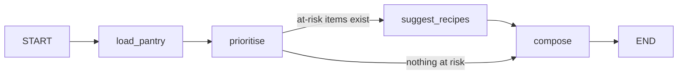

# FridgeMate — Architecture

## Problem statement

> A person cooking for a household needs to know **which food to use tonight and what to
> make with it**, because groceries are bought faster than they are tracked and items
> spoil unseen at the back of the fridge — Singapore households throw out an estimated
> [cite: NEA food-waste figure] of edible food a year.

This problem exists with or without AI: the need is "use what I have before it goes off",
not "I want a chatbot". That is what the deck asks a problem statement to do.

## Why agentic (plan / act / adapt)

A fixed script can sort a list by date. It cannot do the part that matters here:

| Capability | Where FridgeMate does it |
| --- | --- |
| **Plans** | The planner sequences prioritise → decide → suggest → compose, and only spends a Sonnet call on recipes when something is actually at risk. |
| **Acts** | Writes structured items to the pantry, computes best-before dates, produces a shopping list, records feedback. |
| **Adapts** | Every "cooked it / skipped it" is logged; the next run feeds a summary of household habits into the recipe prompt, so suggestions drift toward what this kitchen uses. |

A fixed workflow would also miss: variable shelf life per item, a pantry that changes
daily, messy receipt input, and personal taste.

## Agents

Each agent does one job and exits (deck: "short, single-purpose agents").

| Agent | Class | Model | Job |
| --- | --- | --- | --- |
| `agents/ingest.py` | Extraction | Haiku 4.5 | Free text / pasted receipt → structured `ParsedItem` rows. Deterministic fallback if Bedrock is down. |
| `agents/prioritiser.py` | Decision-Support | *none — pure Python* | Rank items by days-to-expiry, assign an urgency band. Deterministic so it is testable and measurable. |
| `agents/recipe.py` | Creative / Generative | Sonnet 4.5 (gen) + Haiku 4.5 (critic) | Draft 2–3 recipes that use up at-risk items, with a bounded generate→critique→refine loop. |
| `agents/planner.py` | Orchestration | — (wires the others) | LangGraph state machine that produces the daily digest. |

## Planner graph



State (`DigestState`) is a small typed dict; each node writes one slice of it. The
conditional edge after `prioritise` is the "decide" step — it skips the expensive
generative agent entirely when the pantry is fine.

## Guardrails (from the deck)

- **Model ids are constants** in `config.py`, never built by string concatenation.
- **The refine loop is bounded** by `MAX_RECIPE_REFINE_LOOPS` (a plain counter that
  ignores the model's own "good enough" opinion). It cannot loop forever.
- **Payloads are small and typed** — Pydantic models pass between agents; the pantry
  and feedback history are held in SQLite, not stuffed into the prompt. Feedback is
  summarised to one line before it goes into a prompt.
- **Structured output** — ingest and recipe agents use `with_structured_output`, so a
  malformed answer raises instead of flowing downstream.
- **Graceful degradation** — ingest falls back to an offline parser; the planner still
  emits a digest when no recipe passes the critic.

## Layout

```
app.py                     Streamlit UI
src/fridgemate/
  config.py                model ids, loop caps, thresholds, paths
  models.py                Pydantic contracts shared by every step
  llm.py                   ChatBedrockConverse factory (only file that imports langchain_aws)
  shelf_life.py            offline category + best-before estimation
  storage.py               SQLite pantry store
  memory.py                SQLite episodic feedback store ("adapt")
  pantry_service.py        glue: ingest result -> stored PantryItems
  agents/ingest.py         Extraction agent
  agents/prioritiser.py    Decision-Support (deterministic)
  agents/recipe.py         Generative agent + reflection loop
  agents/planner.py        LangGraph orchestrator
scripts/verify_bedrock.py  one-shot connectivity + model check
scripts/demo.py            seed a pantry, run one digest (for the demo video)
tests/                     pytest suite for the deterministic core
docs/                      this file + the evaluation plan
```
